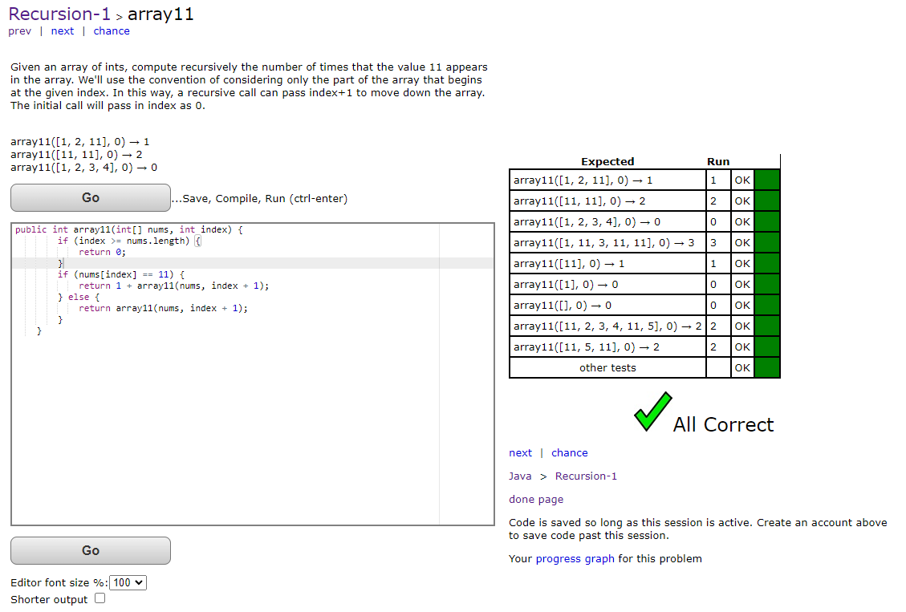
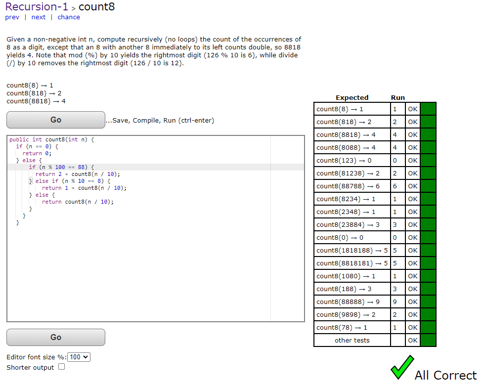

Hello class,

This array11 function looks through an array to find how many times the number 11 appears. It starts at the beginning and checks each number one by one. If it finds an 11, it makes a note. It keeps doing this, going to the next number each time, until it has looked at all the numbers.

As the function moves through the array, it keeps a running total of how many 11s it has found. Once it has checked every number, it stops and tells you the total count of 11s. This way, it goes through each number in the array just once, counting 11s as it goes.

The count8 function in Java figures out how many times the number 8 shows up in another number. If 8 is right next to another 8, then it counts as two. The function looks at the last digit of the number: if it's an 8 and the one before it is also an 8, it counts twice, if it's just an 8, it counts once. After checking the last digit, the function chops off the last digit and does the same thing again with the next last digit.

The function keeps doing this—checking the last digit, counting 8s, and chopping off the last digit—until there are no more digits left. In the end, it tells you the total number of 8s that were in the original number, with any double 8s counted twice. It's like peeling an onion layer by layer and counting spots as you go.

Thank you!

